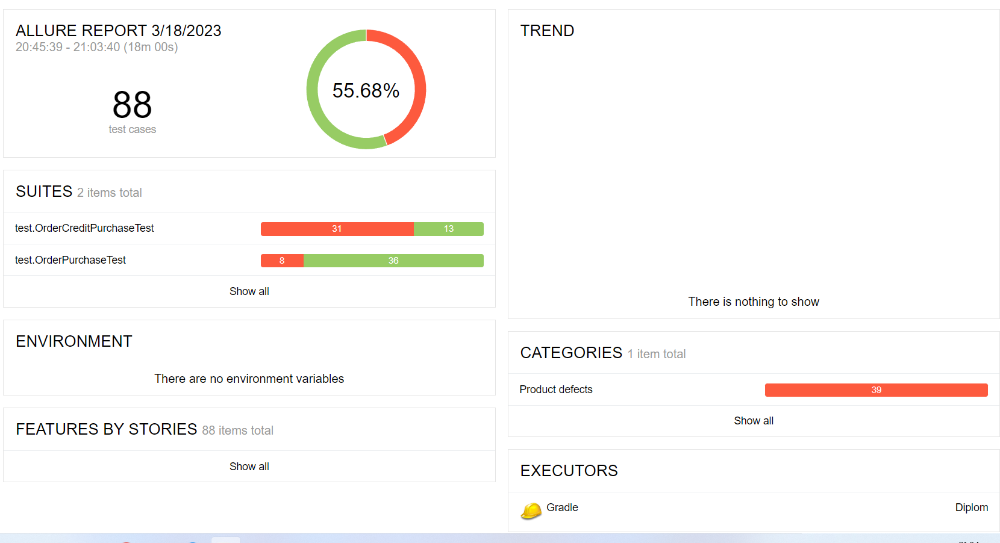
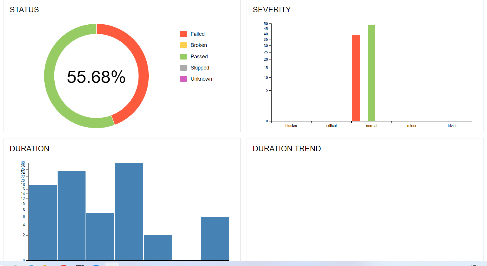

Отчет о тестировании

Согласну плану, разработана тестовая среда с возможностью запуска и тестирования приложения под двумя разными СУБД (MySQL и Postgers).

Allure отчет по результатам прогона автотестов
Allure отчет по итогам прогона автотестов:

Колличество автотестов

Было выполнено 88 автоматизированных тест-кейсов

Успешность автотестов

31 успешных автотестов (35.23%)
57 не успешных автотестов (64.77%)
18 баг-репортов

Общие рекомендации

-Устранение багов, указанных в баг-репортах